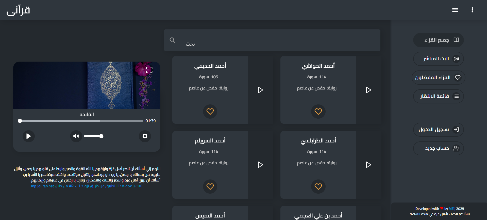

<div align="center">

# 🕌 قرآني | Quraani

<p align="center">
  <strong>تطبيق ويب حديث لتلاوة وسماع القرآن الكريم</strong><br>
  <em>A modern web application for Quran recitation and listening</em>
</p>

[](https://quraani.vercel.app/)
[](https://github.com/your-username/quraani)
[](LICENSE)

</div>

---

## 🚀 المميزات | Features

- 🎵 **تشغيل صوتي عالي الجودة** - High-quality audio playback
- 🔍 **بحث متقدم** - Advanced search functionality  
- 📱 **تصميم متجاوب** - Responsive design for all devices
- 🌙 **وضع ليلي** - Dark mode support
- 🌍 **متعدد اللغات** - Multi-language support (Arabic/English)
- ❤️ **قائمة المفضلة** - Favorites list
- 📋 **قوائم تشغيل مخصصة** - Custom playlists
- 👤 **ملفات شخصية** - User profiles
- 📡 **بث مباشر** - Live streaming

## 🛠️ التقنيات المستخدمة | Built With

<div align="center">


</div>

### 📦 المكتبات الرئيسية | Key Dependencies

- **Vue Router** - للتنقل بين الصفحات
- **Vuex** - لإدارة الحالة
- **Vue I18n** - للترجمة ودعم اللغات المتعددة
- **Axios** - لطلبات HTTP
- **Materialize CSS** - للتصميم والمكونات
- **Vue Plyr** - لمشغل الوسائط
- **jQuery** - للتفاعلات المتقدمة

## 🚀 البدء السريع | Quick Start

### 📋 المتطلبات | Prerequisites

- Node.js (إصدار 14 أو أحدث)
- npm أو yarn

### ⚡ التثبيت والتشغيل | Installation & Setup

```bash
# استنسخ المستودع | Clone the repository
git clone https://github.com/elewashy/quraani.git

# انتقل إلى مجلد المشروع | Navigate to project directory
cd quraani

# ثبت المتطلبات | Install dependencies
npm install

# شغل الخادم التطويري | Start development server
npm run dev
```

### 🏗️ البناء للإنتاج | Build for Production

```bash
# ابن للإنتاج | Build for production
npm run build

# شغل الخادم | Start production server
npm start
```

## 📁 هيكل المشروع | Project Structure

```
quraani/
├── 📁 public/           # الملفات العامة
├── 📁 src/
│   ├── 📁 assets/       # الصور والستايلات
│   ├── 📁 components/   # مكونات Vue
│   ├── 📁 plugins/      # الإضافات والتكوينات
│   ├── 📁 router/       # تكوين التوجيه
│   ├── 📁 store/        # إدارة الحالة Vuex
│   └── 📁 views/        # صفحات التطبيق
├── 📄 package.json      # تكوين المشروع
└── 📄 vue.config.js     # تكوين Vue CLI
```

## 🌐 الصفحات | Pages

- **🏠 الرئيسية** - عرض القراء والسور
- **🔍 البحث** - البحث في السور والقراء
- **❤️ المفضلة** - السور والقراء المفضلة
- **📋 قوائم التشغيل** - إنشاء وإدارة قوائم مخصصة
- **👤 الملف الشخصي** - إعدادات المستخدم
- **📡 البث المباشر** - الاستماع للبث المباشر

## 🎨 لقطات شاشة | Screenshots

<div align="center">
  
</div>

## 🤝 المساهمة | Contributing

نرحب بالمساهمات! يرجى اتباع الخطوات التالية:

1. 🍴 Fork المشروع
2. 🌿 أنشئ فرع للميزة الجديدة (`git checkout -b feature/AmazingFeature`)
3. 💾 احفظ التغييرات (`git commit -m 'Add some AmazingFeature'`)
4. 📤 ادفع إلى الفرع (`git push origin feature/AmazingFeature`)
5. 🔄 افتح Pull Request

## 📧 التواصل | Contact

- 📧 البريد الإلكتروني: elewashy9@gmail.com
- 💼 لينكد إن: [your-linkedin](https://linkedin.com/in/elewashy)

## 📄 الترخيص | License

هذا المشروع مرخص تحت رخصة MIT - راجع ملف [LICENSE](LICENSE) للتفاصيل.

---

<div align="center">

**صُنع بـ ❤️ في مصر**

🇵🇸 **اللهم انصر إخواننا في فلسطين وغزة** 🇵🇸
**Free Palestine 🕊️ | Stand with Gaza 💚**

*نسأل الله العظيم رب العرش العظيم أن ينصر إخواننا في فلسطين ويفرج كربهم ويرد عنهم كيد الظالمين*

[](https://github.com/elewashy)
[](https://github.com/elewashy/quraani)

</div>
